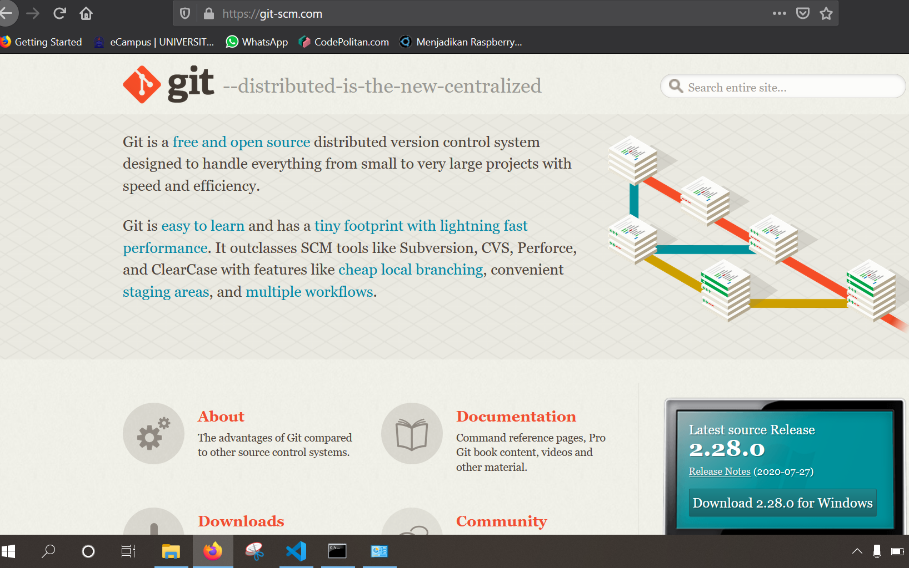
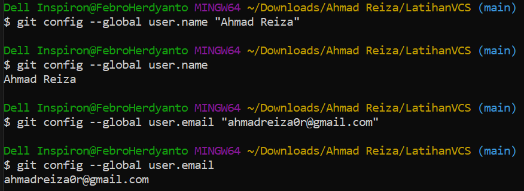
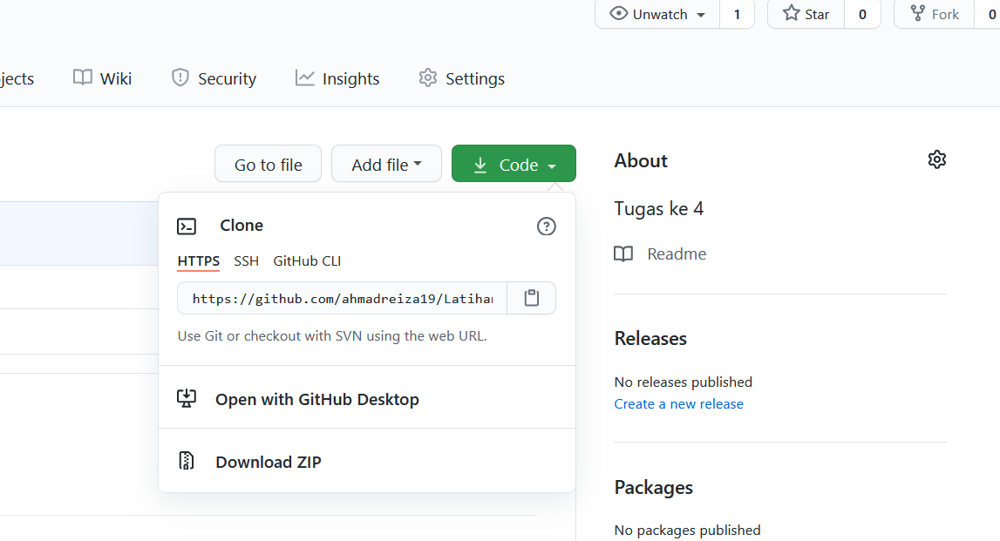
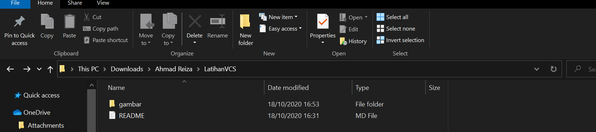
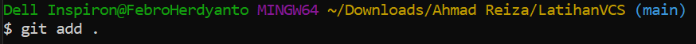
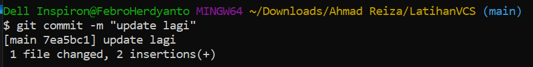
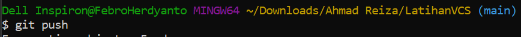
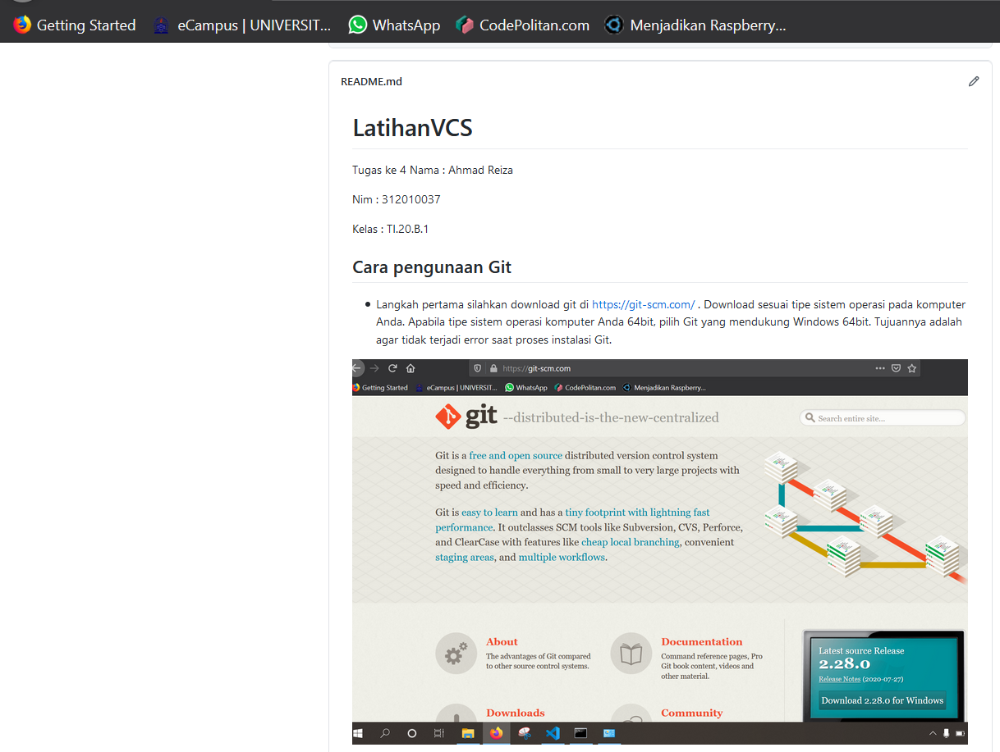

# LatihanVCS
Tugas ke 4
Nama    : Ahmad Reiza

Nim     : 312010037

Kelas   : TI.20.B.1

## Cara pengunaan Git

* Langkah pertama silahkan download git di https://git-scm.com/ . Download sesuai tipe sistem operasi pada komputer Anda. Apabila tipe sistem operasi komputer Anda 64bit,  pilih Git yang mendukung Windows 64bit. Tujuannya adalah agar tidak terjadi error saat proses instalasi Git.

* Setelah di download silahkan installasi

* Setelah menginstall lalu cek version di Git Bash atau Anda perlu mengecek apakah instalasi Git berhasil atau tidak. Anda bisa mengeceknya melalui Command Prompt. Klik Win+R lalu ketik CMD untuk membuka Command Prompt 

* Lalu Add User (Nama/Email) 
 

* Lalu membuat akun GitHub di https://github.com/

* Setelah selesai lalu membuat Repository , Anda perlu mengisi detail informasi berikut:

    Nama Repository : digunakan untuk identitas repository yang dibuat.

    Deskripsi Repository : berfungsi untuk deskripsi dari repository yang dibuat.

    Jenis Repository   : jenis repository  dibagi menjadi Public dan Private. Ketika Anda mengatur repository menjadi Public, orang lain dapat melihat repository yang Anda buat. Sebaliknya, jika Anda mengaturnya sebagai Private, repository tersebut hanya bisa diakses oleh Anda.

Setelah mengisi detail informasi di atas, klik Create Repository.

* Kemudian salin link GitHub

* Lalu ditempelkan di Git clone di folder

* Setelah itu edit file README.md 

* Kemudian ketik "git add" lalu enter

* Kemudian ketik "git commit" lalu enter

* Kemudian ketik "git push" lalu enter

* Setelah itu cek di github, jika seperti gambar dibawah ini maka anda sudah benar

